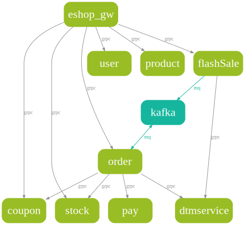

## spograph

`spograph` is a tool for generating business architecture diagram based on the Go development framework [**Sponge**](https://github.com/zhufuyi/sponge).

### Quick Start

#### Install spograph

```bash
go install github.com/zhufuyi/spograph@latest
```

#### Example of Use

Open a project created with Sponge, for example:  [eshop/example-2-mono-repo](https://github.com/zhufuyi/sponge_examples/tree/main/_14_eshop/example-2-mono-repo)

```bash
# Case 1: Generate a business architecture diagram for the entire project
spograph --project-dir=example-2-mono-repo

# Case 2: Generate a business architecture diagram for specific services
spograph --server-dir=example-2-mono-repo/flashSale --server-dir=example-2-mono-repo/order

# To include database services in the diagram, add the "--all" parameter
```

Output svg example:


